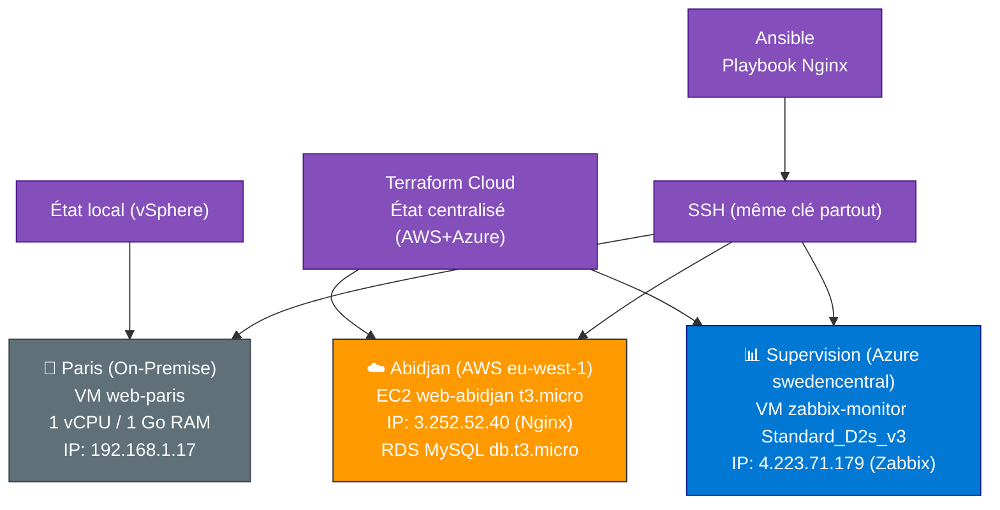

<h2 align="center">🚀 RECHERCHE ALTERNANCE — SEPTEMBRE 2026</h2>

🗓️ Rythme : 3 semaines en entreprise / 1 semaine d'école

<h1 align="center">Hello Bienvenu, je suis Steeve WOMO TCHINDA, Je construis et sécurise des infrastructures qui ne tombent pas en panne et quand elles sont attaquées, je le sais avant que ça fasse mal.</h1>

🛡️ Cybersécurité | Réseaux & Systèmes | Maintien en Condition Opérationnelle (MCO) 
🔐 Passionné par la sécurisation des infrastructures complexes, le Zero Trust et la détection des menaces.

  
  
  
  

  
  
  

---

## 🚀 À propos de moi

Actuellement en fin de formation **Expert Réseau Infrastructure et Sécurité (Titre RNCP Niveau 7)** à l'IMIE Paris, je poursuis un Master universitaire en Sécurité Informatique au CNAM Angers à la prochaine rentrée. Fort de **2 ans d'expérience terrain**, je conçois, administre et sécurise des environnements hybrides hautement disponibles.

Je suis à la recherche active d'un **Stage de fin d'étude immédiatement** et d'une **alternance de 24 mois à la prochaine rentrée 2026** pour consolider mon expertise opérationnelle en cybersécurité au sein d'une entreprise dynamique et innovante.

| 🛡️ Sécurité & SOC | 🌐 Réseaux & Firewalling | 💻 Systèmes & Virtualisation | ⚙️ Automatisation & MCO |
|---|---|---|---|
| SIEM Wazuh & Splunk | OPNsense (CARP/HA), Fortigate & Mikrotik | VMware ESXi/vCenter, Proxmox | Bash, Python, PowerShell |
| Détection d'intrusions | VLAN 802.1Q, VPN (WireGuard/IPSec) | Windows Server 2022 (AD, GPO) | Zabbix, IPAM/DCIM (NetBox) |
| IAM, Authelia, MFA | Cisco (CCNA en cours) | Ubuntu, Oracle Linux, Red hat, FreeBSD | Plan de Reprise d'Activité |
| Zero Trust Architecture | Filtrage, ACL, NAT, Routage/Switching | Veeam Backup & Replication | CI/CD & Kubernetes, Ansible & Terraform (Notions) |

---

## 👑 Projet Phare : Le Projet Résilience (Infrastructure HDS)

Ce portfolio documente la conception de A à Z d'une **infrastructure de santé fictive (Clinique Le Châtelet)** répondant aux exigences réglementaires HDS, NIS2 et RGPD. Ce n'est pas un simple laboratoire, c'est une architecture d'entreprise micro-segmentée, durcie et hautement résiliente. 

> **Visualisation de l'architecture :**

  

➡️ **[Voir le repo](https://github.com/Yemah/clinique-chatelet-secure-infra)** · **[Voir la documentation](https://yemah.github.io/clinique-chatelet-secure-infra/)**

---

## Projet Terraform complet déployant une infra hybride : • vSphere 8 (Paris) – VM AD, Web interne • AWS (Abidjan) – EC2 + RDS MySQL • Azure – VM Zabbix + stockage • Terraform Cloud (backend) + Ansibl…

**📖 Description**

Ce dépôt contient le code **Infrastructure as Code (IaC)** permettant de déployer et configurer l'infrastructure hybride de l'entreprise fictif **NTIC CENTER CORPORATION**, répartie sur trois plans de contrôle :

| Site | Plateforme | Rôle |
|---|---|---|
| **Paris** | VMware vSphere 8 (on-premise) | Intranet d'entreprise (clone de template + cloud-init) |
| **Abidjan** | AWS (`eu-west-1`) | Services publics : EC2 (Nginx) + RDS MySQL |
| **Supervision** | Azure (`swedencentral`) | VM Zabbix pour la supervision globale |

Le provisioning est assuré par **Terraform** (modules dédiés par provider), et la configuration applicative (Nginx) par **Ansible**, appliquée de manière homogène sur les trois environnements.

>**Architecture simplifier**

---

➡️ **[Voir le repo](https://github.com/Yemah/ntic-center-infra)** 

Le document d'architecture complet (DAT) décrivant les choix de conception, les matrices de flux, la sécurité et les incidents rencontrés est disponible dans [DAT Complet](https://github.com/Yemah/ntic-center-infra/blob/main/docs/DAT_NTIC_CENTER_CORPORATION.md).

---

## 💼 Expériences Professionnelles

### 🌐 Administrateur Système et Réseau (Alternance)
**BSRQ.MEDIA** | *Sept 2024 – Oct 2025*
* Refonte Architecturale & Segmentation : Conception et déploiement en autonomie d'une architecture réseau sécurisée (passage d'un réseau plat à une infrastructure segmentée VLANs), intégrant un firewall MikroTik et une redondance Dual-WAN (Orange/SFR) pour un site de production critique.
* Administration Hybride & MCO : Gestion complète d'une infrastructure bi-sites hétérogène (Windows Server AD/DNS/DHCP/GPO, Linux, Proxmox) et d'équipements réseaux (Cisco, Aruba, OPNsense en HA), assurant la continuité de service et la résolution d'incidents N1 à N3.
* Sécurisation Zero Trust : Implémentation d'une stratégie Zero Trust sur un périmètre ранее non protégé : déploiement de VPN inter-sites (WireGuard, OpenVPN-AS), authentification forte (MFA, SSO Azure AD/Entra ID) et contrôle d'accès via bastion Apache Guacamole.
Automatisation & Documentation : Automatisation des tâches d'exploitation récurrentes via scripts Python et Bash, et maintien d'une documentation technique à jour (IPAM/DCIM) via NetBox pour une traçabilité totale.
* Support & Gestion de Parc : Pilotage du support IT interne, gestion du cycle de vie des équipements et coordination technique avec les prestataires externes.

### 🛡️ Analyste Infrastructure et Sécurité (Stage)
**ACS'IT** | *Mai 2023 – Août 2023*
* Déploiement SIEM Wazuh : Installation et configuration d'une plateforme SIEM Wazuh sur 80+ terminaux, centralisant la supervision des événements de sécurité en temps réel.
* Détection & Réponse (MTTD) : Analyse et corrélation de logs multi-sources pour identifier les anomalies, réduisant le délai moyen de détection (MTTD) de 40 %.
* Optimisation SOC : Qualification et tri de 120+ alertes/semaine par l'affinement continu des règles de détection, diminuant les faux positifs de 35 % et optimisant le temps de réponse des analystes.

### 🖥️ Administrateur Système (Stage)
**CAMTEL** | *Juil 2022 – Oct 2022*
* Administration Active Directory : Gestion de l'identité et des accès pour 35+ utilisateurs (création de 50+ comptes, déploiement de GPO de sécurité, audit des privilèges), garantissant la conformité du SI.
* Sécurité Opérationnelle : Surveillance proactive des journaux système, contribution à la résolution d'incidents de sécurité (N1/N2) et mise en œuvre d'actions correctives pour réduire la surface d'attaque.

---

## 💼 Parcours

| Période | Formation | Entreprise |
|---      | ---       |---         |
|     2026 – 2028     | Master Sécurité informatique et cybermenaces | **CNAM** Angers |
|     2024 – 2026     | Mastère Expert Réseau Infrastructure et Sécurité (RNCP N7) | **IMIE Paris** Levallois-Perret |
|     2024 – 2025     | Mastère Expert Réseau Infrastructure et Sécurité | **IMIE Paris** Levallois-Perret |
|     2023 – 2024     | Cycle Ingénieur Informatique et Réseau Année 3 | **ESAIP Ecole d'Ingénieurs** Saint Barthélémy d'Anjou |
|     2022 – 2023     | Bachelor Conception des Systèmes de l'Information | **3IL Ingénieurs** Limoges |

**Certifications** : CCNA 200-301 (en cours) · Az-900 Azure Fundamentals · Scrum Fundamentals

---

## 🛠️ Stack technique

**Réseaux & Sécurité**

**SIEM / Monitoring**

**Systèmes & Virtualisation**

**Scripting & Cloud**

---

## 📊 Statistiques GitHub

---

## 🤝 Connectons-nous & Collaborons !
## Let's Connect & Collaborate !

### 📬 Informations de Contact

---

  <em>"Sécuriser l'architecture d'aujourd'hui pour anticiper les menaces de demain."</em>

># ⭐ Support

Si vous trouvez mon travail intéressant,  
n'hésitez pas à **donner une étoile ⭐ au repository** !
